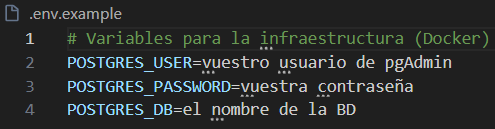
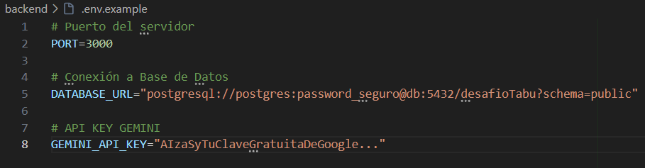
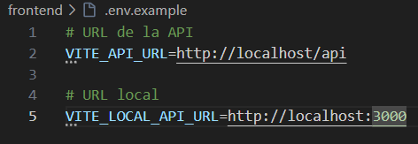

# 🃏 Desafío Cartas Tabú

¡Bienvenido al proyecto **Desafío Cartas Tabú**! Esta aplicación web _full-stack_ permite la gestión, creación y juego de cartas de estilo Tabú, organizadas por **Familias Profesionales** y **Temáticas**. El sistema cuenta con control de roles (`ADMIN`, `CREATOR`, `USER`) y gestión de visibilidad de los recursos.

---

## 👥 Equipo de Desarrollo

| Avatar | Desarrollador | Rol | GitHub |
| :---: | :--- | :--- | :--- |
|  | **Alfredo Carrero Muñiz** | Full-Stack Developer | [@Alfredo-Carrero](https://github.com/Alfredo-Carrero) |
|  | **Marta Frontón Sainero** | Full-Stack Developer | [@martafronton](https://github.com/martafronton)       |
|  | **Noelia Barrionuevo**    | Full-Stack Developer | [@noeBR97](https://github.com/noeBR97)                 |
|  | **Jaime Ortega Núñez**    | Full-Stack Developer | [@jornu99](https://github.com/jornu99)                 |

---

## 🛠️ Tecnologías Utilizadas

El proyecto está completamente contenerizado utilizando **Docker** y se compone de los siguientes servicios:

- **Backend:** [NestJS](https://nestjs.com/) con Node.js, gestionado con **Yarn**.
- **ORM:** [Prisma ORM](https://www.prisma.io/) para modelado y control de la base de datos.
- **Base de Datos:** [PostgreSQL](https://www.postgresql.org/).
- **Frontend:** [React](https://react.dev/) con **Vite** para un desarrollo ágil, gestionado con **Yarn**.
- **Servidor Web / Proxy:** [Nginx](https://www.nginx.com/) actuando como proxy inverso en el puerto `80`.

---

## 🚀 Despliegue del Entorno de Desarrollo

El proyecto está configurado para que el Frontend, el Backend, la Base de Datos y las semillas (**Seeds**) se inicialicen automáticamente con un único comando.

### 1. Clonar el repositorio

```bash
git clone https://github.com/Desafio-Tabu/Desafio-CartasTabu.git
```

### 2. Configuración de Variables de Entorno

Antes de iniciar el despliegue con Docker, debes crear los archivos de configuración de entorno `.env` a partir de sus respectivas plantillas.

**En Linux / macOS (copiar y pegar bloque completo):**
```bash
cp .env.example .env
cp backend/.env.example backend/.env
cp frontend/.env.example frontend/.env
```
**En Windows - PowerShell (copiar y pegar bloque completo):**
```powershell
copy .env.example .env
copy backend/.env.example backend/.env
copy frontend/.env.example frontend/.env
```

Una vez creados, debes configurar las variables de entorno en cada archivo. A continuación, tienes la guía detallada de qué rellenar en cada uno:

#### A. Archivo `.env` en la Raíz
Contiene la configuración de la base de datos para levantar el contenedor PostgreSQL:
* **`POSTGRES_USER`**: Nombre del usuario administrador de PostgreSQL (por ejemplo, `postgres` o el usuario que uses en pgAdmin).
* **`POSTGRES_PASSWORD`**: Contraseña segura elegida para dicho usuario.
* **`POSTGRES_DB`**: Nombre de la base de datos a crear (por ejemplo, `desafioTabu`).



---

#### B. Archivo `backend/.env` (Directorio /backend)
Configuración necesaria para que NestJS se conecte a la base de datos usando Prisma y consuma la API de Gemini:
* **`PORT`**: Puerto interno donde correrá la API (normalmente `3000`).
* **`DATABASE_URL`**: Cadena de conexión para Prisma. Debe coincidir con los valores que configuraste en la raíz.
  * *Formato:* `postgresql://<POSTGRES_USER>:<POSTGRES_PASSWORD>@db:5432/<POSTGRES_DB>?schema=public`
* **`GEMINI_API_KEY`**: Clave de API de Google Gemini para las funciones basadas en Inteligencia Artificial.

  > [GUÍA]
  > **Pasos para obtener tu API Key de Gemini:**
  > 1. Accede al sitio web oficial de [Google AI Studio](https://aistudio.google.com/).
  > 2. Inicia sesión utilizando tu cuenta de Google.
  > 3. Haz clic en el botón **"Claves de API"**.
  > 4. Selecciona **"Crear clave de API"** (Crear clave de API). Puedes elegir crearla en un nuevo proyecto o en uno existente.
  > 5. Copia la API Key generada (que suele empezar por `AIzaSy...`) y pégala en esta variable.
  >



---

#### C. Archivo `frontend/.env` (Directorio /frontend)
Configuración para el cliente de React (Vite):
* **`VITE_API_URL`**: Ruta base del proxy inverso de Nginx para el entorno contenerizado (por defecto `http://localhost/api`).
* **`VITE_LOCAL_API_URL`**: Ruta del backend corriendo en desarrollo directo (por defecto `http://localhost:3000`).




### 3. Comando Único de Arranque

Para construir y levantar todo el ecosistema (incluyendo la ejecución interna de migraciones y la carga de datos en Postgres), abre tu terminal en la raíz del proyecto y ejecuta:

```bash
docker compose up --build -d
```

### 4. Limpieza Completa (Opcional)

Si deseas eliminar cualquier contenedor, imagen o volumen anterior antes de comenzar de cero, ejecuta el siguiente bloque:

```bash
docker compose down --rmi all --volumes --remove-orphans
```

### 5. Inicialización Manual de la Base de Datos (Opcional)

Si por algún motivo la base de datos no se inicializa o no se aplican los datos de ejemplo de manera automática, puedes forzar la ejecución ejecutando este bloque completo:

```bash
docker compose exec backend yarn prisma generate
docker compose exec backend yarn prisma migrate deploy
docker compose exec backend yarn seed
```

---